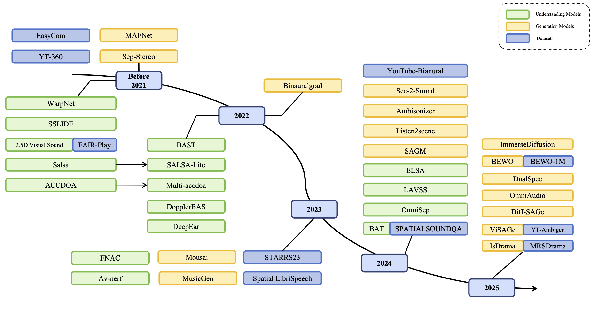
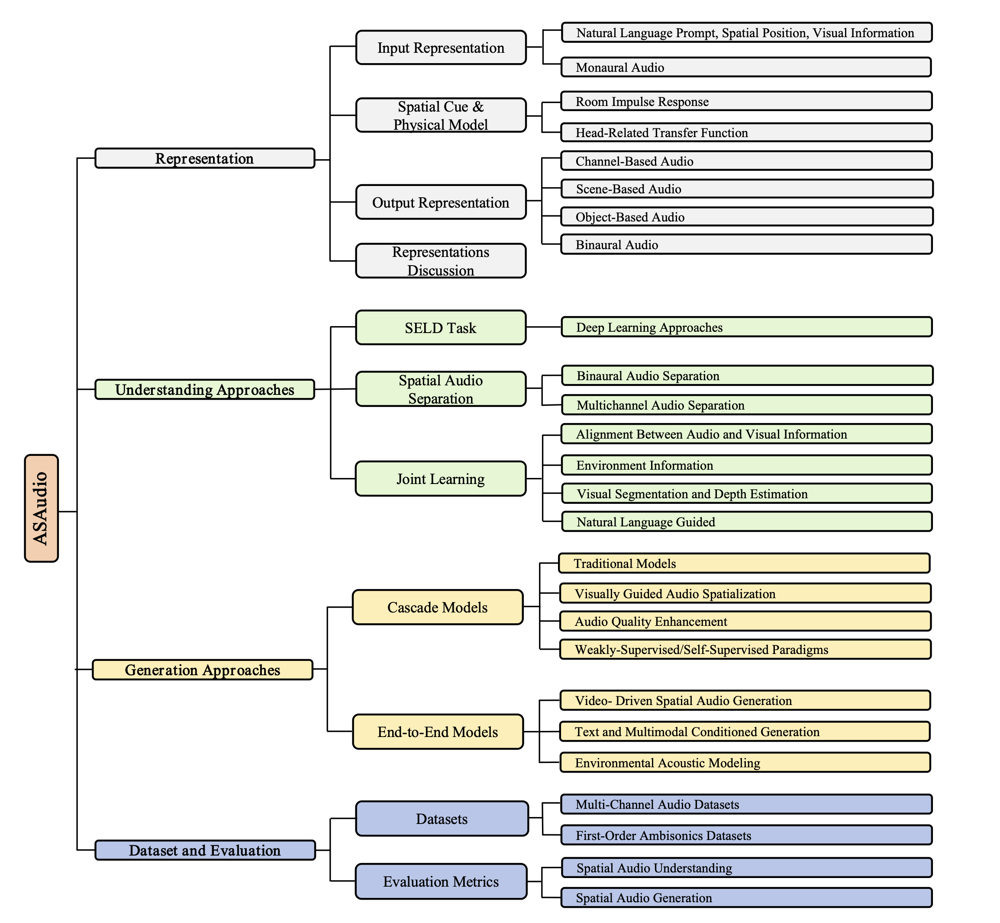
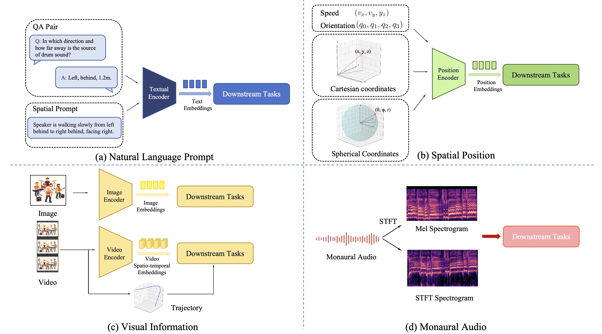

# ASAudio: A Survey of Advanced Spatial Audio Research

 # 🚀Quick Start 

- [ASAudio: A Survey of Advanced Spatial Audio Research](#asaudio-a-survey-of-advanced-spatial-audio-research)
- [🚀Quick Start](#quick-start)
  - [Introduction](#introduction)
  - [Overall](#overall)
  - [Representations of Spatial Audio](#representations-of-spatial-audio)
      - [1. Input Representations](#1-input-representations)
      - [2. Spatial Cues and Physical Modeling](#2-spatial-cues-and-physical-modeling)
          - [2.1 Room Impulse Response (RIR)](#21-room-impulse-response-rir)
          - [2.2 Head Related Transfer Function (HRTF)](#22-head-related-transfer-function-hrtf)
      - [3. Output Representations](#3-output-representations)
  - [4. Spatial Audio Understanding Models](#4-spatial-audio-understanding-models)
      - [4.1 SELD Papers](#41-seld-papers)
      - [4.2 Spatial Audio Separation Papers](#42-spatial-audio-separation-papers)
      - [4.3 Joint Learning Papers](#43-joint-learning-papers)
  - [5. Spatial Audio Generation Models](#5-spatial-audio-generation-models)
  - [6. Spatial Audio Datasets](#6-spatial-audio-datasets)

## Introduction

This repository is the official repository of the **ASAudio: A Survey of Advanced Spatial Audio Research**.

Figure 1: The timeline of spatial audio models & datasets in recent years.

> Abstract
>
> With the rapid development of spatial audio technologies today, applications in AR, VR and other scenarios have garnered extensive attention. Unlike traditional mono sound, spatial audio offers a more realistic and immersive auditory experience. Despite notable progress in the field, there remains a lack of comprehensive surveys that systematically organize and analyze these methods and their underlying technologies. In this paper, we provide a comprehensive overview of spatial audio and systematically review recent literature in the area. To address this, we chronologically outline existing work related to spatial audio and categorize these studies based on input-output representations, as well as generation and understanding tasks, thereby summarizing various research aspects of spatial audio. In addition, we review related datasets, evaluation metrics, and benchmarks, offering insights from both training and evaluation perspectives. 

## Overall

Figure 2: Orgnization of this survey.

## Representations of Spatial Audio

#### 1. Input Representations

| Attribute         | Natural Language                      | Spatial Position                | Visual Information                | Monaural Audio                   |
|:-:|:-:|:-:|:-:|:-:|
| Primary Info      | Semantic, relational, implicit spatial| Explicit spatial, dynamic       | Semantic, spatial, dynamic        | Acoustic (timbre, pitch, content)|
| Control Precision | Low                                  | Very high                       | High                              | N/A                              |
| Abstraction Level | High                                 | Low                             | High                              | Low                              |
| Interpretability  | Indirect                             | Direct                          | Indirect                          | Indirect                         |
| Key Challenges    | Ambiguity; semantic–signal gap        | No semantics; tedious authoring | Ambiguity; occlusion; compute cost| Lack of spatial cues             |

Table 1: Comparative analysis of spatial audio input representations

Figure 1: The input representations and their fundamental processing steps.

#### 2. Spatial Cues and Physical Modeling

###### 2.1 Room Impulse Response (RIR)

<table style="width: 100%; table-layout: fixed;">
    <colgroup>
       <col span="1" style="width: 73%;">
       <col span="1" style="width: 12%;">
       <col span="1" style="width: 15%;">
    </colgroup>
    <thead>
        <tr>
            <th> Paper </th>
            <th> URL </th>
            <th> Code/Dataset </th>
        </tr>
    </thead>
    <tbody>
        <tr>
            <td style="overflow-wrap: break-word; hyphens: auto;" lang="en">Few-shot audio-visual learning of environment acoustics</td>
            <td><a href="https://arxiv.org/abs/2206.04006">
Link
</a></td>
            <td><a href="https://github.com/SAGNIKMJR/few-shot-rir">
Link
</a></td>
        </tr>
        <tr>
            <td style="overflow-wrap: break-word; hyphens: auto;" lang="en">Spatial scaper: a library to simulate and augment soundscapes for sound event localization and detection in realistic rooms</td>
            <td><a href="https://arxiv.org/abs/2401.12238">
Link
</a></td>
            <td><a href="https://github.com/marl/SpatialScaper">
Link
</a></td>
        </tr>
        <tr>
            <td style="overflow-wrap: break-word; hyphens: auto;" lang="en">Novel-view acoustic synthesis from 3D reconstructed rooms</td>
            <td><a href="https://arxiv.org/abs/2310.15130">
Link
</a></td>
            <td><a href="https://github.com/apple/ml-nvas3d">
Link
</a></td>
        </tr>
        <tr>
            <td style="overflow-wrap: break-word; hyphens: auto;" lang="en">A binaural room impulse response database for the evaluation of dereverberation algorithms</td>
            <td><a href="https://ieeexplore.ieee.org/document/5201259">
Link
</a></td>
            <td><a href="https://www.mathworks.com/matlabcentral/fileexchange/29073-air-database">
Link
</a></td>
        </tr>
        <tr>
            <td style="overflow-wrap: break-word; hyphens: auto;" lang="en">The Sweet-Home speech and multimodal corpus for home automation interaction</td>
            <td><a href="https://www.researchgate.net/publication/280751765_The_Sweet-Home_speech_and_multimodal_corpus_for_home_automation_interaction">
Link
</a></td>
            <td> 
 - 
</td>
        </tr>
        <tr>
            <td style="overflow-wrap: break-word; hyphens: auto;" lang="en">Dataset of Binaural Room Impulse Responses at Multiple Recording Positions, Source Positions, and Orientations in a Real Room</td>
            <td><a href="https://pub.dega-akustik.de/DAGA_2017/data/articles/000359.pdf">
Link
</a></td>
           <td>
 - 
</td> 
        </tr>
        <tr>
            <td style="overflow-wrap: break-word; hyphens: auto;" lang="en">dEchorate: a calibrated room impulse response database for echo-aware signal processing</td>
            <td><a href="https://arxiv.org/abs/2104.13168">
Link
</a></td>
            <td><a href="https://github.com/Chutlhu/dEchorate">
Link
</a></td>
        </tr>
        <tr>
            <td style="overflow-wrap: break-word; hyphens: auto;" lang="en">BIRD: Big impulse response dataset</td>
            <td><a href="https://arxiv.org/abs/2010.09930">
Link
</a></td>
            <td><a href="https://github.com/FrancoisGrondin/BIRD">
Link
</a></td>
        </tr>
       <tr>
            <td style="overflow-wrap: break-word; hyphens: auto;" lang="en">Visually informed binaural audio generation without binaural audios</td>
            <td><a href="https://arxiv.org/abs/2104.06162">
Link
</a></td>
            <td><a href="https://github.com/SheldonTsui/PseudoBinaural_CVPR2021">
Link
</a></td>
        </tr>
        <tr>
            <td style="overflow-wrap: break-word; hyphens: auto;" lang="en">MeshRIR: A dataset of room impulse responses on meshed grid points for evaluating sound field analysis and synthesis methods</td>
            <td><a href="https://arxiv.org/abs/2106.10801">
Link
</a></td>
            <td><a href="https://github.com/sh01k/MeshRIR">
Link
</a></td>
        </tr>
        <tr>
            <td style="overflow-wrap: break-word; hyphens: auto;" lang="en">Mesh2ir: Neural acoustic impulse response generator for complex 3d scenes</td>
            <td><a href="https://arxiv.org/abs/2205.09248">
Link
</a></td>
            <td><a href="https://github.com/anton-jeran/MESH2IR">
Link
</a></td>
        </tr>
        <tr>
            <td style="overflow-wrap: break-word; hyphens: auto;" lang="en">A dataset of reverberant spatial sound scenes with moving sources for sound event localization and detection</td>
            <td><a href="https://arxiv.org/abs/2006.01919">
Link
</a></td>
            <td><a href="https://dcase-repo.github.io/dcase_datalist/datasets/sounds/tau_nigens_spatial_events_2020.html">
Link
</a></td>
        </tr>
       <tr>
            <td style="overflow-wrap: break-word; hyphens: auto;" lang="en">Acoustic analysis and dataset of transitions between coupled rooms</td>
            <td><a href="https://ieeexplore.ieee.org/document/9415122/">
Link
</a></td>
            <td>
 - 
</td>
        </tr>
        <tr>
            <td style="overflow-wrap: break-word; hyphens: auto;" lang="en">Dataset of spatial room impulse responses in a variable acoustics room for six degrees-of-freedom rendering and analysis</td>
            <td><a href="https://arxiv.org/abs/2111.11882">
Link
</a></td>
            <td><a href="https://zenodo.org/records/6382405">
Link
</a></td>
        </tr>
        <tr>
            <td style="overflow-wrap: break-word; hyphens: auto;" lang="en">On the authenticity of individual dynamic binaural synthesis</td>
            <td><a href="https://pubs.aip.org/asa/jasa/article/142/4/1784/853094">
Link
</a></td>
            <td>
 - 
</td>
        </tr>
    </tbody>
</table>
Table 2: The list of RIR papers and their URL

  

###### 2.2 Head Related Transfer Function (HRTF)

<table style="width: 100%; table-layout: fixed;">
    <colgroup>
       <col span="1" style="width: 73%;">
       <col span="1" style="width: 12%;">
       <col span="1" style="width: 15%;">
    </colgroup>
    <thead>
        <tr>
            <th> Paper </th>
            <th> URL </th>
            <th> Code/Dataset </th>
        </tr>
    </thead>
    <tbody>
        <tr>
            <td style="overflow-wrap: break-word; hyphens: auto;" lang="en">HRTF personalization based on ear morphology</td>
            <td><a href="https://research.facebook.com/publications/hrtf-personalization-based-on-ear-morphology/">
Link
</a></td>
            <td>
 - 
</td>
        </tr>
        <tr>
            <td style="overflow-wrap: break-word; hyphens: auto;" lang="en">On HRTF Notch Frequency Prediction using Anthropometric Features and Neural Networks</td>
            <td><a href="https://arxiv.org/abs/2403.07579">
Link
</a></td>
            <td>
 - 
</td>
        </tr>
        <tr>
            <td style="overflow-wrap: break-word; hyphens: auto;" lang="en">Magnitude modeling of personalized HRTF based on ear images and anthropometric measurements</td>
            <td><a href="https://www.mdpi.com/2076-3417/12/16/8155">
Link
</a></td>
            <td>
 - 
</td>
        </tr>
        <tr>
            <td style="overflow-wrap: break-word; hyphens: auto;" lang="en">Global HRTF interpolation via learned affine transformation of hyper-conditioned features</td>
            <td><a href="https://arxiv.org/abs/2204.02637">
Link
</a></td>
            <td><a href="https://github.com/jin-woo-lee/hrtf-interpolation">
Link
</a></td>
        </tr>
        <tr>
            <td style="overflow-wrap: break-word; hyphens: auto;" lang="en">HRTF recommendation based on the predicted binaural colouration model</td>
            <td><a href="https://ieeexplore.ieee.org/abstract/document/10448092">
Link
</a></td>
            <td> 
 - 
</td>
        </tr>
        <tr>
            <td style="overflow-wrap: break-word; hyphens: auto;" lang="en">Modeling individual head-related transfer functions from sparse measurements using a convolutional neural network</td>
            <td><a href="8/2873496/Modeling-individual-head-related-transfer?redirectedFrom=fulltext">
Link
</a></td>
           <td>
 - 
</td> 
        </tr>
        <tr>
            <td style="overflow-wrap: break-word; hyphens: auto;" lang="en">Head-related transfer function interpolation from spatially sparse measurements using autoencoder with source position conditioning</td>
            <td><a href="https://arxiv.org/abs/2207.10967">
Link
</a></td>
            <td><a href="https://github.com/ikets/HRTFInterpAE_public">
Link
</a></td>
        </tr>
        <tr>
            <td style="overflow-wrap: break-word; hyphens: auto;" lang="en">HRTF upsampling with a generative adversarial network using a gnomonic equiangular projection</td>
            <td><a href="https://arxiv.org/abs/2306.05812">
Link
</a></td>
            <td><a href="https://github.com/ahogg/HRTF-upsampling-with-a-generative-adversarial-network-using-a-gnomonic-equiangular-projection">
Link
</a></td>
        </tr>
       <tr>
            <td style="overflow-wrap: break-word; hyphens: auto;" lang="en">Spatial upsampling of head-related transfer functions using a physics-informed neural network</td>
            <td><a href="https://arxiv.org/abs/2307.14650">
Link
</a></td>
            <td><a href="https://github.com/feima1024/PINN-for-HRTF-upsampling">
Link
</a></td>
        </tr>
        <tr>
            <td style="overflow-wrap: break-word; hyphens: auto;" lang="en">HRTF field: Unifying measured HRTF magnitude representation with neural fields</td>
            <td><a href="https://arxiv.org/abs/2210.15196">
Link
</a></td>
            <td><a href="https://github.com/yzyouzhang/HRTF_field">
Link
</a></td>
        </tr>
        <tr>
            <td style="overflow-wrap: break-word; hyphens: auto;" lang="en">Head-related transfer function interpolation with a spherical CNN</td>
            <td><a href="https://arxiv.org/abs/2309.08290">
Link
</a></td>
            <td><a href="https://github.com/xingyuaudio">
Link
</a></td>
        </tr>
        <tr>
            <td style="overflow-wrap: break-word; hyphens: auto;" lang="en">HRTF interpolation using a spherical neural process meta-learner</td>
            <td><a href="https://arxiv.org/abs/2310.13430">
Link
</a></td>
            <td>
 - 
</td>
        </tr>
        <tr>
            <td style="overflow-wrap: break-word; hyphens: auto;" lang="en">NIIRF: Neural IIR Filter Field for HRTF Upsampling and Personalization</td>
            <td><a href="https://arxiv.org/abs/2402.17907">
Link
</a></td>
            <td><a href="https://github.com/merlresearch/neural-IIR-field">
Link
</a></td>
        </tr>
    </tbody>
</table>
Table 3: The list of HRTF papers and their URL

#### 3. Output Representations

| Attribute  | Channel-Based | Scene-Based | Object-Based     |
|:-:|:-:|:-:|:-:|
| Freedom of Listening Position| Limited | High| Moderate  |
| Playback System Dependency | Very high  | High| Low    |
| Scalability| Low | Moderate | Excellent |
| Playback-End Complexity | Low | High| Moderate |
| **Common Formats** | Stereo; 5.1/7.1 surround | Ambisonics; wave-field synthesis (WFS)| Dolby Atmos; DTS:X; MPEG-H 3D Audio|

Table 4: Comparative analysis of spatial audio output representations

## 4. Spatial Audio Understanding Models

#### 4.1 SELD Papers

<table style="width: 100%; table-layout: fixed;">
    <colgroup>
       <col span="1" style="width: 73%;">
       <col span="1" style="width: 12%;">
       <col span="1" style="width: 15%;">
    </colgroup>
    <thead>
        <tr>
            <th> Paper </th>
            <th> URL </th>
            <th> Code </th>
        </tr>
    </thead>
    <tbody>
        <tr>
            <td style="overflow-wrap: break-word; hyphens: auto;" lang="en">A probabilistic model for robust localization based on a binaural auditory front-end</td>
            <td><a href="https://ieeexplore.ieee.org/document/5406118">
Link
</a></td>
            <td>
 - 
</td>
        </tr>
        <tr>
            <td style="overflow-wrap: break-word; hyphens: auto;" lang="en">Sound event localization and detection of overlapping sources using convolutional recurrent neural networks</td>
            <td><a href="https://arxiv.org/abs/1807.00129">
Link
</a></td>
            <td><a href="https://github.com/sharathadavanne/seld-net">
Link
</a></td>
        </tr>
        <tr>
            <td style="overflow-wrap: break-word; hyphens: auto;" lang="en">3D localization of multiple sound sources with intensity vector estimates in single source zones</td>
            <td><a href="https://ieeexplore.ieee.org/document/7362645">
Link
</a></td>
            <td>
 - 
</td>
        </tr>
        <tr>
            <td style="overflow-wrap: break-word; hyphens: auto;" lang="en">Towards generating ambisonics using audio-visual cue for virtual reality</td>
            <td><a href="https://ieeexplore.ieee.org/document/8683318">
Link
</a></td>
            <td><a href="https://github.com/V-Sense/360AudioVisual">
Link
</a></td>
        </tr>
        <tr>
            <td style="overflow-wrap: break-word; hyphens: auto;" lang="en">Deepear: Sound localization with binaural microphones</td>
            <td><a href="https://ieeexplore.ieee.org/document/9954178">
Link
</a></td>
            <td> 
 - 
</td>
        </tr>
        <tr>
            <td style="overflow-wrap: break-word; hyphens: auto;" lang="en">AD-YOLO: You look only once in training multiple sound event localization and detection</td>
            <td><a href="https://arxiv.org/abs/2303.15703">
Link
</a></td>
           <td>
 - 
</td> 
        </tr>
        <tr>
            <td style="overflow-wrap: break-word; hyphens: auto;" lang="en">Polyphonic Sound Event Detection and Localization using a Two-Stage Strategy</td>
            <td><a href="https://arxiv.org/abs/1905.00268">
Link
</a></td>
            <td><a href="https://github.com/yinkalario/Two-Stage-Polyphonic-Sound-Event-Detection-and-Localization">
Link
</a></td>
        </tr>
        <tr>
            <td style="overflow-wrap: break-word; hyphens: auto;" lang="en">An improved event-independent network for polyphonic sound event localization and detection</td>
            <td><a href="https://arxiv.org/abs/2010.13092">
Link
</a></td>
            <td><a href="https://github.com/yinkalario/EIN-SELD">
Link
</a></td>
        </tr>
       <tr>
            <td style="overflow-wrap: break-word; hyphens: auto;" lang="en">ACCDOA: Activity-coupled cartesian direction of arrival representation for sound event localization and detection</td>
            <td><a href="https://arxiv.org/abs/2010.15306">
Link
</a></td>
            <td>
 - 
</td>
        </tr>
        <tr>
            <td style="overflow-wrap: break-word; hyphens: auto;" lang="en">Multi-accdoa: Localizing and detecting overlapping sounds from the same class with auxiliary duplicating permutation invariant training</td>
            <td><a href="https://arxiv.org/abs/2110.07124">
Link
</a></td>
            <td>
 - 
</td>
        </tr>
        <tr>
            <td style="overflow-wrap: break-word; hyphens: auto;" lang="en">Salsa: Spatial cue-augmented log-spectrogram features for polyphonic sound event localization and detection</td>
            <td><a href="https://arxiv.org/abs/2110.00275">
Link
</a></td>
            <td><a href="https://github.com/thomeou/SALSA">
Link
</a></td>
        </tr>
        <tr>
            <td style="overflow-wrap: break-word; hyphens: auto;" lang="en">Sound event localization based on sound intensity vector refined by DNN-based denoising and source separation</td>
            <td><a href="https://arxiv.org/abs/2002.05994">
Link
</a></td>
            <td>
 - 
</td>
        </tr>
        <tr>
            <td style="overflow-wrap: break-word; hyphens: auto;" lang="en">Binaural sound source distance estimation and localization for a moving listener</td>
            <td><a href="https://ieeexplore.ieee.org/document/10372100">
Link
</a></td>
            <td><a href="https://github.com/danielkrause/Moving-Binaural-SDEL">
Link
</a></td>
        </tr>
        <tr>
            <td style="overflow-wrap: break-word; hyphens: auto;" lang="en">Binaural source localization using deep learning and head rotation information</td>
            <td><a href="https://ieeexplore.ieee.org/document/9909764">
Link
</a></td>
            <td>
 - 
</td>
        </tr>
        <tr>
            <td style="overflow-wrap: break-word; hyphens: auto;" lang="en">Learning Audio-Visual Source Localization via False Negative Aware Contrastive Learning</td>
            <td><a href="https://arxiv.org/abs/2303.11302">
Link
</a></td>
            <td><a href="https://github.com/OpenNLPLab/FNAC_AVL">
Link
</a></td>
        </tr>
        <tr>
            <td style="overflow-wrap: break-word; hyphens: auto;" lang="en">w2v-SELD: A Sound Event Localization and Detection Framework for Self-Supervised Spatial Audio Pre-Training</td>
            <td><a href="https://arxiv.org/abs/2312.06907">
Link
</a></td>
            <td><a href="https://github.com/Orlllem/seld_wav2vec2">
Link
</a></td>
        </tr>
        <tr>
            <td style="overflow-wrap: break-word; hyphens: auto;" lang="en">Self-supervised moving vehicle tracking with stereo sound</td>
            <td><a href="https://arxiv.org/abs/1910.11760">
Link
</a></td>
            <td>
 - 
</td>
        </tr>
        <tr>
            <td style="overflow-wrap: break-word; hyphens: auto;" lang="en">Audio-visual event localization in unconstrained videos</td>
            <td><a href="https://arxiv.org/abs/1803.08842">
Link
</a></td>
            <td>
 - 
</td>
        </tr>
        <tr>
            <td style="overflow-wrap: break-word; hyphens: auto;" lang="en">Sound event localization and detection using squeeze-excitation residual CNNs</td>
            <td><a href="https://arxiv.org/abs/2006.14436">
Link
</a></td>
            <td><a href="https://github.com/janaal1/DCASE2020-Task3">
Link
</a></td>
        </tr>
        <tr>
            <td style="overflow-wrap: break-word; hyphens: auto;" lang="en">BAST: Binaural audio spectrogram transformer for binaural sound localization</td>
            <td><a href="https://arxiv.org/abs/2207.03927">
Link
</a></td>
            <td><a href="https://github.com/ShengKuangCN/BAST">
Link
</a></td>
        </tr>
        <tr>
            <td style="overflow-wrap: break-word; hyphens: auto;" lang="en">Sslide: Sound source localization for indoors based on deep learning</td>
            <td><a href="https://arxiv.org/abs/2010.14420">
Link
</a></td>
            <td>
 - 
</td>
        </tr>
        <tr>
            <td style="overflow-wrap: break-word; hyphens: auto;" lang="en">Semi-supervised source localization with deep generative modeling</td>
            <td><a href="https://arxiv.org/abs/2005.13163">
Link
</a></td>
            <td>
 - 
</td>
        </tr>
        <tr>
            <td style="overflow-wrap: break-word; hyphens: auto;" lang="en">Semi-supervised source localization in reverberant environments with deep generative modeling</td>
            <td><a href="https://ieeexplore.ieee.org/document/9449880">
Link
</a></td>
            <td>
 - 
</td>
        </tr>
    </tbody>
</table>
Table 5: The list of SELD Papers and their URL

#### 4.2 Spatial Audio Separation Papers

<table style="width: 100%; table-layout: fixed;">
    <colgroup>
       <col span="1" style="width: 73%;">
       <col span="1" style="width: 12%;">
       <col span="1" style="width: 15%;">
    </colgroup>
    <thead>
        <tr>
            <th> Paper </th>
            <th> URL </th>
            <th> Code </th>
        </tr>
    </thead>
    <tbody>
        <tr>
            <td style="overflow-wrap: break-word; hyphens: auto;" lang="en">Source separation based on binaural cues and source model constraints</td>
            <td><a href="https://www.ee.columbia.edu/~dpwe/pubs/WeissME08-MESSL-SP.pdf">
Link
</a></td>
            <td>
 - 
</td>
        </tr>
        <tr>
            <td style="overflow-wrap: break-word; hyphens: auto;" lang="en">The cocktail party robot: Sound source separation and localisation with an active binaural head</td>
            <td><a href="https://ieeexplore.ieee.org/document/6249602">
Link
</a></td>
            <td>
 - 
</td>
        </tr>
        <tr>
            <td style="overflow-wrap: break-word; hyphens: auto;" lang="en">Deep learning based binaural speech separation in reverberant environments</td>
            <td><a href="https://ieeexplore.ieee.org/document/7886357">
Link
</a></td>
            <td>
 - 
</td>
        </tr>
        <tr>
            <td style="overflow-wrap: break-word; hyphens: auto;" lang="en">Combining spectral and spatial features for deep learning based blind speaker separation</td>
            <td><a href="https://ieeexplore.ieee.org/document/8540037">
Link
</a></td>
            <td>
 - 
</td>
        </tr>
        <tr>
            <td style="overflow-wrap: break-word; hyphens: auto;" lang="en">Real-time binaural speech separation with preserved spatial cues</td>
            <td><a href="https://arxiv.org/pdf/2002.06637">
Link
</a></td>
            <td> 
 - 
</td>
        </tr>
        <tr>
            <td style="overflow-wrap: break-word; hyphens: auto;" lang="en">Lavss: Location-guided audio-visual spatial audio separation</td>
            <td><a href="https://arxiv.org/abs/2310.20446">
Link
</a></td>
            <td><a href="https://github.com/YYX666660/LAVSS">
Link
</a></td>
        </tr>
        <tr>
            <td style="overflow-wrap: break-word; hyphens: auto;" lang="en">Multi-channel deep clustering: Discriminative spectral and spatial embeddings for speaker-independent speech separation</td>
            <td><a href="https://ieeexplore.ieee.org/document/8461639">
Link
</a></td>
            <td>
 - 
</td>
        </tr>
       <tr>
            <td style="overflow-wrap: break-word; hyphens: auto;" lang="en">Multichannel audio source separation with deep neural networks</td>
            <td><a href="https://arxiv.org/abs/2109.00704">
Link
</a></td>
            <td>
 - 
</td>
        </tr>
        <tr>
            <td style="overflow-wrap: break-word; hyphens: auto;" lang="en">Integration of variational autoencoder and spatial clustering for adaptive multi-channel neural speech separation</td>
            <td><a href="http://arxiv.org/abs/2011.11984">
Link
</a></td>
            <td><a href="https://github.com/BUTSpeechFIT/vae_dolphin">
Link
</a></td>
        </tr>
        <tr>
            <td style="overflow-wrap: break-word; hyphens: auto;" lang="en">Self-supervised generation of spatial audio for 360 video</td>
            <td><a href="https://arxiv.org/abs/1809.02587">
Link
</a></td>
            <td><a href="https://github.com/pedro-morgado/spatialaudiogen">
Link
</a></td>
        </tr>
    </tbody>
</table>
Table 6: The list of Spatial Audio Separation Papers and their URL

#### 4.3 Joint Learning Papers

<table style="width: 100%; table-layout: fixed;">
    <colgroup>
       <col span="1" style="width: 73%;">
       <col span="1" style="width: 12%;">
       <col span="1" style="width: 15%;">
    </colgroup>
    <thead>
        <tr>
            <th> Paper </th>
            <th> URL </th>
            <th> Code </th>
        </tr>
    </thead>
    <tbody>
        <tr>
            <td style="overflow-wrap: break-word; hyphens: auto;" lang="en">Learning representations from audio-visual spatial alignment</td>
            <td><a href="https://arxiv.org/abs/2011.01819">
Link
</a></td>
            <td>
 - 
</td>
        </tr>
        <tr>
            <td style="overflow-wrap: break-word; hyphens: auto;" lang="en">Telling left from right: Learning spatial correspondence of sight and sound</td>
            <td><a href="https://arxiv.org/abs/2006.06175">
Link
</a></td>
            <td><a href="https://github.com/karreny/telling-left-from-right/tree/master">
Link
</a></td>
        </tr>
        <tr>
            <td style="overflow-wrap: break-word; hyphens: auto;" lang="en">Av-nerf: Learning neural fields for real-world audio-visual scene synthesis</td>
            <td><a href="https://arxiv.org/abs/2302.02088">
Link
</a></td>
            <td><a href="https://github.com/liangsusan-git/AV-NeRF">
Link
</a></td>
        </tr>
        <tr>
            <td style="overflow-wrap: break-word; hyphens: auto;" lang="en">Learning neural acoustic fields</td>
            <td><a href="https://arxiv.org/abs/2204.00628">
Link
</a></td>
            <td><a href="https://github.com/aluo-x/Learning_Neural_Acoustic_Fields">
Link
</a></td>
        </tr>
        <tr>
            <td style="overflow-wrap: break-word; hyphens: auto;" lang="en">Overview of geometrical room acoustic modeling techniques</td>
            <td><a href="https://pubs.aip.org/asa/jasa/article/138/2/708/917382/Overview-of-geometrical-room-acoustic-modeling">
Link
</a></td>
            <td> 
 - 
</td>
        </tr>
        <tr>
            <td style="overflow-wrap: break-word; hyphens: auto;" lang="en">Av-rir: Audio-visual room impulse response estimation</td>
            <td><a href="https://arxiv.org/abs/2312.00834">
Link
</a></td>
           <td><a href="https://github.com/anton-jeran/AV-RIR">
Link
</a></td>
        </tr>
        <tr>
            <td style="overflow-wrap: break-word; hyphens: auto;" lang="en">Impulse response data augmentation and deep neural networks for blind room acoustic parameter estimation</td>
            <td><a href="https://ieeexplore.ieee.org/document/9052970/">
Link
</a></td>
            <td>
 - 
</td>
        </tr>
       <tr>
            <td style="overflow-wrap: break-word; hyphens: auto;" lang="en">Multi-Channel Mosra: Mean Opinion Score and Room Acoustics Estimation Using Simulated Data and A Teacher Model</td>
            <td><a href="https://arxiv.org/abs/2309.11976">
Link
</a></td>
            <td>
 - 
</td>
        </tr>
        <tr>
            <td style="overflow-wrap: break-word; hyphens: auto;" lang="en">Few-shot audio-visual learning of environment acoustics</td>
            <td><a href="https://arxiv.org/abs/2206.04006">
Link
</a></td>
            <td><a href="https://github.com/SAGNIKMJR/few-shot-rir">
Link
</a></td>
        </tr>
        <tr>
            <td style="overflow-wrap: break-word; hyphens: auto;" lang="en">Blind room parameter estimation using multiple multichannel speech recordings</td>
            <td><a href="https://arxiv.org/abs/2107.13832">
Link
</a></td>
            <td><a href="https://github.com/prerak23/RoomParamEstim">
Link
</a></td>
        </tr>
        <tr>
            <td style="overflow-wrap: break-word; hyphens: auto;" lang="en">Visual-based spatial audio generation system for multi-speaker environments</td>
            <td><a href="https://arxiv.org/abs/2502.07538">
Link
</a></td>
            <td>
 - 
</td>
        </tr>
        <tr>
            <td style="overflow-wrap: break-word; hyphens: auto;" lang="en">Learning Spatially-Aware Language and Audio Embeddings</td>
            <td><a href="https://arxiv.org/abs/2409.11369">
Link
</a></td>
            <td>
 - 
</td>
        </tr>
        <tr>
            <td style="overflow-wrap: break-word; hyphens: auto;" lang="en">BAT: Learning to Reason about Spatial Sounds with Large Language Models</td>
            <td><a href="https://arxiv.org/abs/2402.01591">
Link
</a></td>
            <td><a href="https://github.com/zszheng147/Spatial-AST">
Link
</a></td>
        </tr>
    </tbody>
</table>
Table 7: The list of Spatial Audio Separation Papers and their URL

## 5. Spatial Audio Generation Models

<table style="width: 100%; table-layout: fixed;">
    <colgroup>
       <col span="1" style="width: 73%;">
       <col span="1" style="width: 12%;">
       <col span="1" style="width: 15%;">
    </colgroup>
    <thead>
        <tr>
            <th> Paper </th>
            <th> URL </th>
            <th> Code </th>
        </tr>
    </thead>
    <tbody>
        <tr>
            <td style="word-break: break-all;">A structural model for binaural sound synthesis</td>
            <td><a href="https://ieeexplore.ieee.org/document/709673">
Link
</a></td>
            <td>
 - 
</td>
        <tr>
            <td style="word-break: break-all;">Neural synthesis of binaural speech from mono audio</td>
            <td><a href="https://openreview.net/forum?id=uAX8q61EVRu">
Link
</a></td>
            <td><a href="https://github.com/facebookresearch/BinauralSpeechSynthesis">
Link
</a></td>
        </tr>
        <tr>
            <td style="word-break: break-all;">2.5 d visual sound</td>
            <td><a href="https://arxiv.org/abs/1812.04204">
Link
</a></td>
            <td><a href="https://github.com/facebookresearch/2.5D-Visual-Sound">
Link
</a></td>
        </tr>
        <tr>
            <td style="word-break: break-all;">Cyclic Learning for Binaural Audio Generation and Localization</td>
            <td><a href="https://openaccess.thecvf.com/content/CVPR2024/papers/Li_Cyclic_Learning_for_Binaural_Audio_Generation_and_Localization_CVPR_2024_paper.pdf">
Link
</a></td>
            <td>
 - 
</td>
        </tr>
        <tr>
            <td style="word-break: break-all;">Beyond mono to binaural: Generating binaural audio from mono audio with depth and cross modal attention</td>
            <td><a href="https://arxiv.org/abs/2111.08046">
Link
</a></td>
            <td>
 - 
</td>
        </tr>
        <tr>
            <td style="word-break: break-all;">Geometry-aware multi-task learning for binaural audio generation from video</td>
            <td><a href="https://arxiv.org/abs/2111.10882">
Link
</a></td>
            <td>
 - 
</td>
        </tr>
        <tr>
            <td style="word-break: break-all;">Multi-attention audio-visual fusion network for audio spatialization</td>
            <td><a href="https://dl.acm.org/doi/10.1145/3460426.3463624">
Link
</a></td>
            <td>
 - 
</td>
        </tr>
        <tr>
            <td style="word-break: break-all;">Visually Guided Binaural Audio Generation with Cross-Modal Consistency</td>
            <td><a href="https://ieeexplore.ieee.org/document/10446399/">
Link
</a></td>
            <td>
 - 
</td>
        </tr>
        <tr>
            <td style="word-break: break-all;">Interpretable binaural ratio for visually guided binaural audio generation</td>
            <td><a href="https://ieeexplore.ieee.org/document/9892951">
Link
</a></td>
            <td>
 - 
</td>
        </tr>
        <tr>
            <td style="word-break: break-all;">Cross-modal generative model for visual-guided binaural stereo generation</td>
            <td><a href="https://arxiv.org/abs/2311.07630">
Link
</a></td>
            <td>
 - 
</td>
        </tr>
        <tr>
            <td style="word-break: break-all;">Binauralgrad: A two-stage conditional diffusion probabilistic model for binaural audio synthesis</td>
            <td><a href="https://arxiv.org/abs/2205.14807">
Link
</a></td>
            <td><a href="https://github.com/microsoft/NeuralSpeech/tree/master/BinauralGrad">
Link
</a></td>
        </tr>
        <tr>
            <td style="word-break: break-all;">DopplerBAS: Binaural Audio Synthesis Addressing Doppler Effect</td>
            <td><a href="https://arxiv.org/abs/2212.07000">
Link
</a></td>
            <td>
 - 
</td>
        </tr>
        <tr>
            <td style="word-break: break-all;">Neural fourier shift for binaural speech rendering</td>
            <td><a href="https://arxiv.org/abs/2211.00878">
Link
</a></td>
            <td><a href="https://github.com/jin-woo-lee/nfs-binaural">
Link
</a></td>
        </tr>
        <tr>
            <td style="word-break: break-all;">Visually informed binaural audio generation without binaural audios</td>
            <td><a href="https://arxiv.org/abs/2104.06162">
Link
</a></td>
            <td><a href="https://github.com/SheldonTsui/PseudoBinaural_CVPR2021">
Link
</a></td>
        </tr>
        <tr>
            <td style="word-break: break-all;">Localize to binauralize: Audio spatialization from visual sound source localization</td>
            <td><a href="https://openaccess.thecvf.com/content/ICCV2021/papers/Rachavarapu_Localize_to_Binauralize_Audio_Spatialization_From_Visual_Sound_Source_Localization_ICCV_2021_paper.pdf">
Link
</a></td>
            <td><a href="https://github.com/KranthiKumarR/Localize-to-Binauralize">
Link
</a></td>
        </tr>
        <tr>
            <td style="word-break: break-all;">Sep-stereo: Visually guided stereophonic audio generation by associating source separation</td>
            <td><a href="https://arxiv.org/abs/2007.09902">
Link
</a></td>
            <td><a href="https://github.com/SheldonTsui/SepStereo_ECCV2020">
Link
</a></td>
        </tr>
        <tr>
            <td style="word-break: break-all;">Exploiting audio-visual consistency with partial supervision for spatial audio generation</td>
            <td><a href="https://arxiv.org/abs/2105.00708">
Link
</a></td>
            <td>
 - 
</td>
        </tr>
        <tr>
            <td style="word-break: break-all;">Binaural audio generation via multi-task learning</td>
            <td><a href="https://arxiv.org/abs/2109.00748?utm_source=feedburner&utm_medium=feed&utm_campaign=Feed%3A+arxiv%2FQSXk+%28ExcitingAds%21+cs+updates+on+arXiv.org%29">
Link
</a></td>
            <td><a href="https://github.com/omeaningless/binaural-audio-generation">
Link
</a></td>
        </tr>
        <tr>
            <td style="word-break: break-all;">End-to-end binaural speech synthesis</td>
            <td><a href="https://arxiv.org/abs/2207.03697">
Link
</a></td>
            <td>
 - 
</td>
        </tr>
        <tr>
            <td style="word-break: break-all;">Upmixing via style transfer: a variational autoencoder for disentangling spatial images and musical content</td>
            <td><a href="https://arxiv.org/abs/2203.12053">
Link
</a></td>
            <td>
 - 
</td>
        </tr>
        <tr>
            <td style="word-break: break-all;">ViSAGe: Video-to-Spatial Audio Generation</td>
            <td><a href="https://arxiv.org/abs/2506.12199">
Link
</a></td>
            <td><a href="https://github.com/jaeyeonkim99/visage">
Link
</a></td>
        </tr>
        <tr>
            <td style="word-break: break-all;">OmniAudio: Generating Spatial Audio from 360-Degree Video</td>
            <td><a href="https://arxiv.org/abs/2504.14906">
Link
</a></td>
            <td><a href="https://github.com/liuhuadai/OmniAudio">
Link
</a></td>
        </tr>
        <tr>
            <td style="word-break: break-all;">Towards generating ambisonics using audio-visual cue for virtual reality</td>
            <td><a href="https://ieeexplore.ieee.org/document/8683318">
Link
</a></td>
            <td><a href="https://github.com/V-Sense/360AudioVisual">
Link
</a></td>
        </tr>
        <tr>
            <td style="word-break: break-all;">Av-nerf: Learning neural fields for real-world audio-visual scene synthesis</td>
            <td><a href="https://arxiv.org/abs/2302.02088">
Link
</a></td>
            <td><a href="https://github.com/liangsusan-git/AV-NeRF">
Link
</a></td>
        </tr>
        <tr>
            <td style="word-break: break-all;">ImmerseDiffusion: A Generative Spatial Audio Latent Diffusion Model</td>
            <td><a href="https://arxiv.org/abs/2410.14945">
Link
</a></td>
            <td>
 - 
</td>
        </tr>
        <tr>
            <td style="word-break: break-all;">Both Ears Wide Open: Towards Language-Driven Spatial Audio Generation</td>
            <td><a href="https://arxiv.org/abs/2410.10676">
Link
</a></td>
            <td><a href="https://github.com/PeiwenSun2000/Both-Ears-Wide-Open">
Link
</a></td>
        </tr>
        <tr>
            <td style="word-break: break-all;">DualSpec: Text-to-spatial-audio Generation via Dual-Spectrogram Guided Diffusion Model</td>
            <td><a href="https://arxiv.org/abs/2502.18952">
Link
</a></td>
            <td>
 - 
</td>
        </tr>
        <tr>
            <td style="word-break: break-all;">Diff-SAGe: End-to-End Spatial Audio Generation Using Diffusion Models</td>
            <td><a href="https://arxiv.org/abs/2410.11299">
Link
</a></td>
            <td>
 - 
</td>
        </tr>
        <tr>
            <td style="word-break: break-all;">Ambisonizer: Neural upmixing as spherical harmonics generation</td>
            <td><a href="https://arxiv.org/abs/2405.13428">
Link
</a></td>
            <td><a href="https://github.com/yongyizang/ambisonizer">
Link
</a></td>
        </tr>
        <tr>
            <td style="word-break: break-all;">ISDrama: Immersive Spatial Drama Generation through Multimodal Prompting</td>
            <td><a href="https://arxiv.org/abs/2504.20630">
Link
</a></td>
            <td><a href="https://github.com/AaronZ345/ISDrama">
Link
</a></td>
        </tr>
        <tr>
            <td style="word-break: break-all;">Simple and controllable music generation</td>
            <td><a href="https://arxiv.org/abs/2306.05284">
Link
</a></td>
            <td><a href="https://github.com/facebookresearch/audiocraft">
Link
</a></td>
        </tr>
        <tr>
            <td style="word-break: break-all;">Moûsai: Text-to-music generation with long-context latent diffusion</td>
            <td><a href="https://arxiv.org/abs/2301.11757">
Link
</a></td>
            <td><a href="https://github.com/archinetai/audio-diffusion-pytorch;">
Link
</a></td>
        </tr>
        <tr>
            <td style="word-break: break-all;">Long-form music generation with latent diffusion</td>
            <td><a href="https://arxiv.org/abs/2404.10301">
Link
</a></td>
            <td><a href="https://github.com/Stability-AI/stable-audio-tools/">
Link
</a></td>
        </tr>
        <tr>
            <td style="word-break: break-all;">Listen2scene: Interactive material-aware binaural sound propagation for reconstructed 3d scenes</td>
            <td><a href="https://arxiv.org/abs/2302.02809">
Link
</a></td>
            <td><a href="https://anton-jeran.github.io/Listen2Scene/">
Link
</a></td>
        </tr>
        <tr>
            <td style="word-break: break-all;">Immersive spatial audio reproduction for vr/ar using room acoustic modelling from 360 images</td>
            <td><a href="https://ieeexplore.ieee.org/document/8798247">
Link
</a></td>
            <td>
 - 
</td>
        </tr>
        <tr>
            <td style="word-break: break-all;">See-2-sound: Zero-shot spatial environment-to-spatial sound</td>
            <td><a href="https://arxiv.org/abs/2406.06612">
Link
</a></td>
            <td><a href="https://github.com/see2sound/see2sound">
Link
</a></td>
        </tr>
    </tbody>
</table>
Table 8: The list of Spatial Audio Generation Papers and their URL

## 6. Spatial Audio Datasets

<table>
    <thead>
        <tr>
            <th>Dataset</th>
            <th>Format</th>
            <th>Collect</th>
            <th>Hours</th>
            <th>Type</th>
            <th>Labels</th>
            <th>URL</th>
        </tr>
    </thead>
    <tbody>
        <tr>
            <td><a href="http://sweet-home-data.imag.fr" target="_blank">
Sweet-Home
</a></td>
            <td>
Multi
</td>
            <td>
Recorded
</td>
            <td>
47.3
</td>
            <td>
Speech
</td>
            <td>
Text
</td>
            <td><a href="https://hal.science/hal-00953006/file/2014_LREC_Vacher_final.pdf" target="_blank">
Link
</a></td>
        </tr>
        <tr>
            <td><a href="https://zenodo.org/records/1314196" target="_blank">
Voice-Home
</a></td>
            <td>
Multi
</td>
            <td>
Recorded
</td>
            <td>
2.5
</td>
            <td>
Speech
</td>
            <td>
Text, Geometric
</td>
            <td><a href="https://inria.hal.science/hal-01343060/file/bertin_IS16.pdf" target="_blank">
Link
</a></td>
        </tr>
        <tr>
            <td>
<a href="https://pedro-morgado.github.io/spatialaudiogen" target="_blank">YT-ALL & REC-STREET</a>
</td>
            <td>
FOA
</td>
            <td>
Crawled
</td>
            <td>
116.5
</td>
            <td>
Audio
</td>
            <td>
Video, Text
</td>
            <td><a href="https://arxiv.org/abs/1809.02587" target="_blank">
Link
</a></td>
        </tr>
        <tr>
            <td><a href="https://github.com/facebookresearch/FAIR-Play" target="_blank">
FAIR-Play
</a></td>
            <td>
Binaural
</td>
            <td>
Recorded
</td>
            <td>
5.2
</td>
            <td>
Audio
</td>
            <td>
Video
</td>
            <td><a href="https://arxiv.org/abs/1812.04204" target="_blank">
Link
</a></td>
        </tr>
        <tr>
            <td><a href="https://zenodo.org/records/3632377#.XjQQUuF7nC" target="_blank">
SECL-UMons
</a></td>
            <td>
Multi
</td>
            <td>
Recorded
</td>
            <td>
5
</td>
            <td>
Audio
</td>
            <td>
Text, Geometric
</td>
            <td><a href="https://ieeexplore.ieee.org/document/9053298" target="_blank">
Link
</a></td>
        </tr>
        <tr>
            <td>
<a href="https://github.com/pedro-morgado/AVSpatialAlignment" target="_blank">YT-360</a>
</td>
            <td>
FOA
</td>
            <td>
Crawled
</td>
            <td>
246
</td>
            <td>
Audio
</td>
            <td>
Video
</td>
            <td><a href="https://arxiv.org/abs/2011.01819" target="_blank">
Link
</a></td>
        </tr>
        <tr>
            <td><a href="https://github.com/facebookresearch/EasyComDataset" target="_blank">
EasyCom
</a></td>
            <td>
Binaural
</td>
            <td>
Recorded
</td>
            <td>
5
</td>
            <td>
Speech
</td>
            <td>
Geometric, Text
</td>
            <td><a href="https://arxiv.org/abs/2107.04174" target="_blank">
Link
</a></td>
        </tr>
        <tr>
            <td><a href="https://github.com/facebookresearch/BinauralSpeechSynthesis/releases/tag/v1.0" target="_blank">
Binaural_Dataset
</a></td>
            <td>
Binaural
</td>
            <td>
Recorded
</td>
            <td>
2
</td>
            <td>
Speech
</td>
            <td>
Geometric
</td>
            <td><a href="https://openreview.net/forum?id=uAX8q61EVRu" target="_blank">
Link
</a></td>
        </tr>
        <tr>
            <td><a href="https://vision.cs.utexas.edu/projects/visually-guided-multitask-spatial/#dataset" target="_blank">
SimBinaural 
</a></td>
            <td>
Binaural
</td>
            <td>
Sim/Crawl
</td>
            <td>
143
</td>
            <td>
Audio
</td>
            <td>
Video, Geometric
</td>
            <td><a href="https://vision.cs.utexas.edu/projects/visually-guided-multitask-spatial/Visually-Guided%20Audio%20Spatialization%20in%20Video%20with%20Geometry-Aware%20Multi-Task%20Learning.pdf" target="_blank">
Link
</a></td>
        </tr>
        <tr>
            <td><a href="https://github.com/apple/ml-spatial-librispeech" target="_blank">
Spatial LibriSpeech
</a></td>
            <td>
FOA
</td>
            <td>
Simulated
</td>
            <td>
650
</td>
            <td>
Speech
</td>
            <td>
Text, Geometric
</td>
            <td><a href="https://arxiv.org/abs/2308.09514" target="_blank">
Link
</a></td>
        </tr>
        <tr>
            <td><a href="https://zenodo.org/record/7880637" target="_blank">
Link
</a></td>
            <td>
FOA
</td>
            <td>
Recorded
</td>
            <td>
7.5
</td>
            <td>
Audio
</td>
            <td>
Video, Geometric
</td>
            <td><a href="https://arxiv.org/abs/2306.09126" target="_blank">
Link
</a></td>
        </tr>
        <tr>
            <td><a href="https://github.com/jaeyeonkim99/visage" target="_blank">
YT-Ambigen
</a></td>
            <td>
FOA
</td>
            <td>
Crawled
</td>
            <td>
142
</td>
            <td>
Audio
</td>
            <td>
Video
</td>
            <td><a href="https://arxiv.org/abs/2406.12199" target="_blank">
Link
</a></td>
        </tr>
        <tr>
            <td><a href="https://github.com/PeiwenSun2000/Both-Ears-Wide-Open?tab=readme-ov-file" target="_blank">
BEWO-1M
</a></td>
            <td>
Binaural
</td>
            <td>
Simulated
</td>
            <td>
2.8k
</td>
            <td>
Audio
</td>
            <td>
Text/Image, Geo
</td>
            <td><a href="https://arxiv.org/abs/2410.10676" target="_blank">
Link
</a></td>
        </tr>
        <tr>
            <td><a href="https://huggingface.co/datasets/AaronZ345/MRSDrama" target="_blank">
MRSDrama
</a></td>
            <td>
Binaural
</td>
            <td>
Recorded
</td>
            <td>
98
</td>
            <td>
Speech
</td>
            <td>
Text, Video, Geo
</td>
            <td><a href="https://arxiv.org/abs/2504.20630" target="_blank">
Link
</a></td>
        </tr>
    </tbody>
</table>
Table 9: The list of Spatial Audio Datasets and their URL

